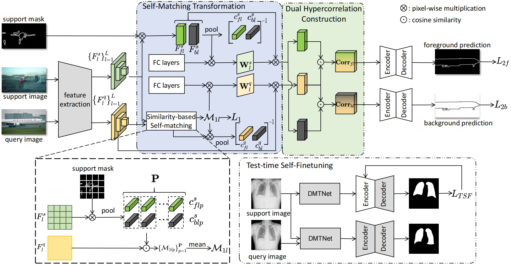
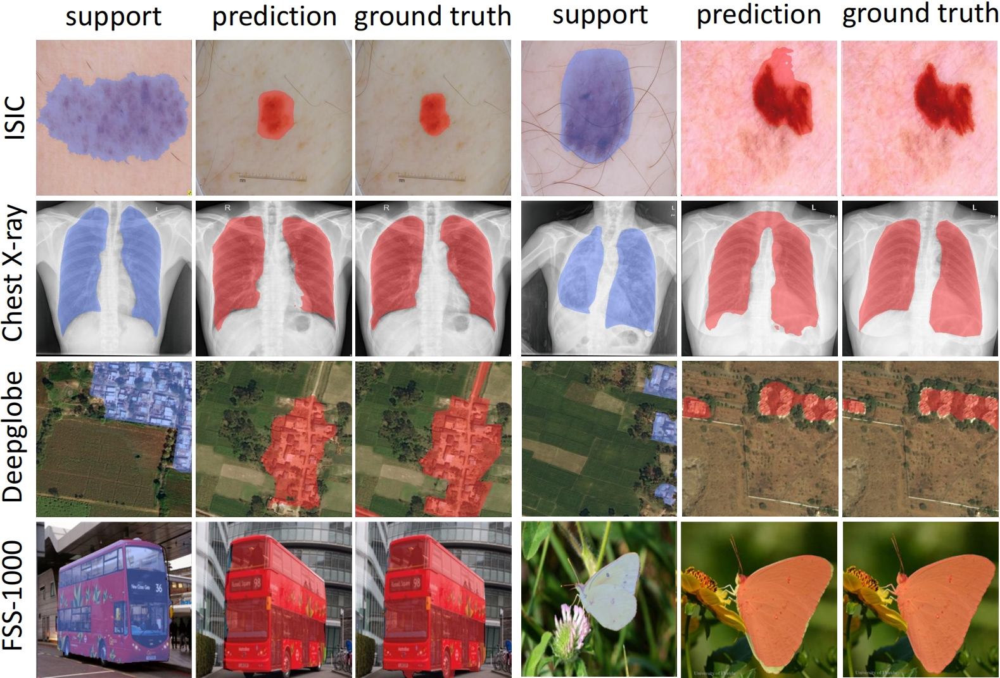

# Cross-Domain Few-Shot Semantic Segmentation via Doubly Matching Transformation

This is the official implementation of our **IJCAI 2024** paper "*Cross-Domain Few-Shot Semantic Segmentation via Doubly Matching Transformation*".

<p align="middle">
    
</p>

## Datasets
The following datasets are used for evaluation in CD-FSS:

### Source domain: 

* **PASCAL VOC2012**:

    Download PASCAL VOC2012 devkit (train/val data):
    ```bash
    wget http://host.robots.ox.ac.uk/pascal/VOC/voc2012/VOCtrainval_11-May-2012.tar
    ```
    Download PASCAL VOC2012 SDS extended mask annotations from [[Google Drive](https://drive.google.com/file/d/10zxG2VExoEZUeyQl_uXga2OWHjGeZaf2/view?usp=sharing)].

### Target domains: 

* **Deepglobe**:

    Home: http://deepglobe.org/

    Direct: https://www.kaggle.com/datasets/balraj98/deepglobe-land-cover-classification-dataset
    
    Refer to [PATNet](https://github.com/slei109/PATNet), please preprocess the downloaded data (data/deepglobe_preprocess.py):
    ```bash
    python deepglobe_preprocess.py
    ```
    Download our preprocessed data from [[Google Drive](https://drive.google.com/drive/folders/1IK8FsnsuJIwnX_ePRriFgid4XwsTd3Kn?usp=sharing)].

* **ISIC2018**:

    Home: http://challenge2018.isic-archive.com

    Direct (must login): https://challenge.isic-archive.com/data#2018

    Class Information: data/isic/class_id.csv

    Refer to [PATNet](https://github.com/slei109/PATNet), please preprocess the downloaded data (data/isic_preprocess.py):
    ```bash
    python isic_preprocess.py
    ```
    Download our preprocessed data from [[Google Drive](https://drive.google.com/drive/folders/1IK8FsnsuJIwnX_ePRriFgid4XwsTd3Kn?usp=sharing)].

* **Chest X-ray**:

    Home: https://www.ncbi.nlm.nih.gov/pmc/articles/PMC4256233/

    Direct: https://www.kaggle.com/datasets/nikhilpandey360/chest-xray-masks-and-labels

* **FSS-1000**:

    Home: https://github.com/HKUSTCV/FSS-1000

    Direct: https://drive.google.com/file/d/16TgqOeI_0P41Eh3jWQlxlRXG9KIqtMgI/view

### Dataset File Organization
```
    Dataset/                                        # dataset
    ├── VOC2012/                                    # source dataset: pascal voc 2012
    |   ├── JPEGImages/
    |   └── SegmentationClassAug/
    ├── Deeoglobe                                   # target dataset: deepglobe
    |   ├── image/                                  # image
    |   └── filter_mask/                            # mask
    |       ├── 1/                                  # category
    |       ├── ...                                 
    |       ├── 6/
    |       ├── 1.txt                               # image name
    |       ├── ...  
    |       └── 6.txt    
    ├── ISIC/                                       # target dataset: isic
    |   ├── ISIC2018_Task1-2_Training_Input/        # image
    |   |   ├── 1/                                  # category
    |   |   ├── 2/
    |   |   └── 3/
    |   └── ISIC2018_Task1_Training_GroundTruth/    # mask
    |       └── ...
    ├── LungSegmentation/                           # target dataset: chest x-ray
    |   ├── CXR_png/                                # image
    |   └── masks/                                  # mask
    └── FSS-1000                                    # target dataset: fss-1000
        ├── ab_wheel/                               # category
        └── ...
```

## Environment

- Python 3.7.16
- PyTorch 1.13.1
- torchvision 0.14.1
- cuda 11.4
- tensorboard 1.14

## Training
> ### PASCAL VOC
> ```bash
> CUDA_VISIBLE_DEVICES=0,1 python -m torch.distributed.run --nnodes=1 --nproc_per_node=2 --node_rank=0 trainDDP.py
> --backbone {vgg16, resnet50}
> --fold 4
> --benchmark pascal
> --bsz 12
> --lr 1e-3
> --logpath "your_experiment_name"
> ```
> We trained DMTNet with 2 NVIDIA RTX A5000. It took approximately 7.5 hours to complete the training process.


## Testing with TSF
You can directly download our trained model weights here👉 [[GoogleDrive](https://drive.google.com/drive/folders/1q0zqrnMcOn-uh5KTZV5wi0-9OrWDHRQh?usp=sharing)]
> ### 1. Deepglobe
> ```bash
> CUDA_VISIBLE_DEVICES=0 python -m torch.distributed.run --nnodes=1 --nproc_per_node=1 --node_rank=0  test_finetuning.py 
> --backbone {vgg16, resnet50}
> --benchmark deepglobe
> --nshot {1, 5}
> --load "path_to_trained_model/best_model.pt"
> --lr 1e-6
> ```

> ### 2. ISIC
> ```bash
> CUDA_VISIBLE_DEVICES=0 python -m torch.distributed.run --nnodes=1 --nproc_per_node=1 --node_rank=0  test_finetuning.py 
> --backbone {vgg16, resnet50}
> --benchmark isic
> --nshot {1, 5}
> --load "path_to_trained_model/best_model.pt"
> --lr 1e-6
> ```

> ### 3. Chest X-ray
> ```bash
> CUDA_VISIBLE_DEVICES=0 python -m torch.distributed.run --nnodes=1 --nproc_per_node=1 --node_rank=0  test_finetuning.py 
> --backbone {vgg16, resnet50}
> --benchmark lung
> --nshot {1, 5}
> --load "path_to_trained_model/best_model.pt"
> --lr 1e-1
> ```

> ### 4. FSS-1000
> ```bash
> CUDA_VISIBLE_DEVICES=0 python -m torch.distributed.run --nnodes=1 --nproc_per_node=1 --node_rank=0  test_finetuning.py 
> --backbone {vgg16, resnet50}
> --benchmark fss
> --nshot {1, 5}
> --load "path_to_trained_model/best_model.pt"
> --lr 1e-6
> ```

## Citation
If you use this code for your research, please consider citing:
```bash
@inproceedings{ijcai2024p71,
  title     = {Cross-Domain Few-Shot Semantic Segmentation via Doubly Matching Transformation},
  author    = {Chen, Jiayi and Quan, Rong and Qin, Jie},
  booktitle = {Proceedings of the Thirty-Third International Joint Conference on
               Artificial Intelligence, {IJCAI-24}},
  publisher = {International Joint Conferences on Artificial Intelligence Organization},
  editor    = {Kate Larson},
  pages     = {641--649},
  year      = {2024},
  month     = {8},
  note      = {Main Track},
  doi       = {10.24963/ijcai.2024/71},
  url       = {https://doi.org/10.24963/ijcai.2024/71},
}
 ```

## Visualization

<p align="middle">
    
</p>

## Acknowledgement
The implementation is based on [PATNet](https://github.com/slei109/PATNet) and [HSNet](https://github.com/juhongm999/hsnet). <br>

## References

[1] Lei, Shuo, Xuchao Zhang, Jianfeng He, Fanglan Chen, Bowen Du and Chang-Tien Lu. “Cross-Domain Few-Shot Semantic Segmentation.” European Conference on Computer Vision (2022).

[2] Min, Juhong, Dahyun Kang and Minsu Cho. “Hypercorrelation Squeeze for Few-Shot Segmenation.” 2021 IEEE/CVF International Conference on Computer Vision (ICCV) (2021): 6921-6932.

